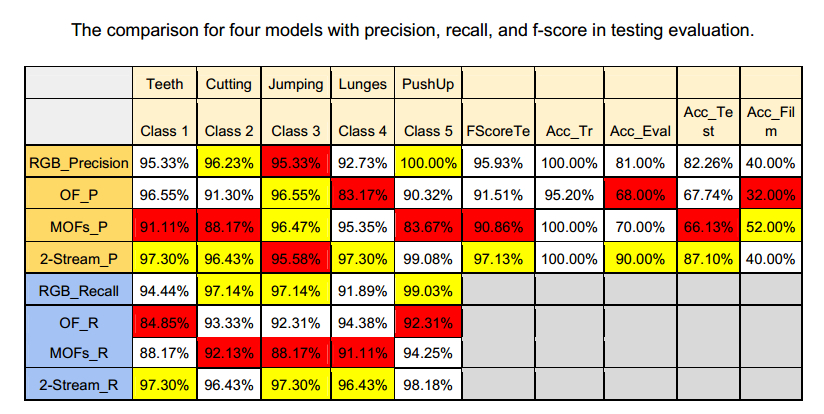
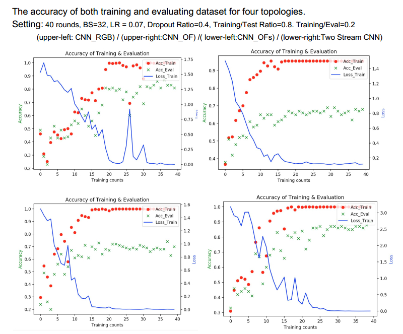

# Goal: 
To achieve action classification from a video by using different topologies 
For example, the trained model can idenfify actions in the video, such as jumping, lunge, cutting vegetables, push-up, brushing teeths etc.

# Dataset:  

We use UCF101 action recognition video dataset and we filmed own videos to perform more realistic testing.

# Topologies for comparison: 
1. CNN by RGB input features
2. CNN by Optical Flow features
3. CNN by Multiple Optical Flow features
4. Two-Stream CNN by RGB and Multiple Optical Flow features

# Techniques:
- Cross-Validation
- Parameter tuning (Batch size, Learning rate, Dropout ratio, and Training Usage ratio)
- Data augmentation (Reduced resolution, Rotation, Mirroring, Cropping)

# Reference:
- UCF101 dataset [here](http://crcv.ucf.edu/data/UCF101.php)
- Simonyan, Karen, and Andrew Zisserman. "Two-stream convolutional networks for action recognition in videos." Advances in neural information processing systems. 2014. [here](https://papers.nips.cc/paper/5353-two-stream-convolutional-networks-for-action-recognition-in-videos.pdf)

Result:

